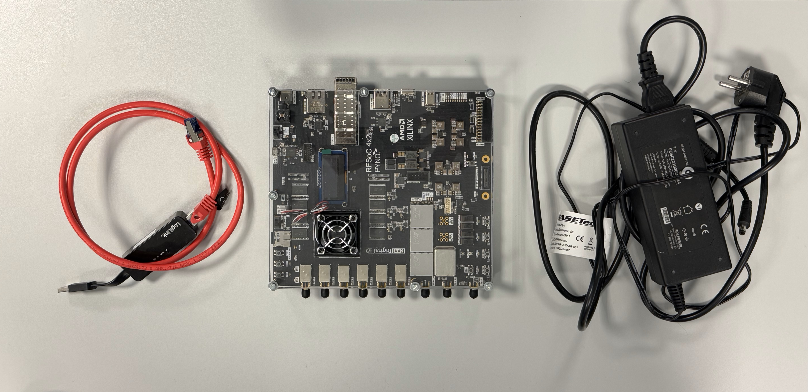

# WirelessSignalTransmission-RFSoC

Wireless Signal Transmission and LED Control Using RFSoC-PYNQ in JupyterLab.

### Zynq UltraScale+ RFSoC

*Description:* A powerful System on Chip (SoC) that integrates high-speed ADCs, DACs, programmable logic, and a processing system, enabling advanced signal processing and embedded development.

## Hardware Requirements
- Zynq UltraScale+ RFSoC boards (Transmitter and Receiver)
- Antennas connected to DAC/ADC
- PMOD circuit with transistors and RGB LEDs for external LED control
- 12V Power supply and Ethernet cables

## Software Requirements
- PYNQ framework (preloaded on RFSoC)
- Python libraries: numpy, ipywidgets, time, ...
- JupyterLab interface (accessed via board IP)

## How to Use
1. Clone this repository
2. Copy the `src/` files into your RFSoC JupyterLab environment
3. Run `transmitter_code.py` on the transmitter board
4. Run `receiver_code.py` on the receiver board
5. Press the on-board buttons to transmit different frequencies

## Contact
For questions, contact Dhaval Kalathiya at kalathiyadhaval1512@gmail.com.
